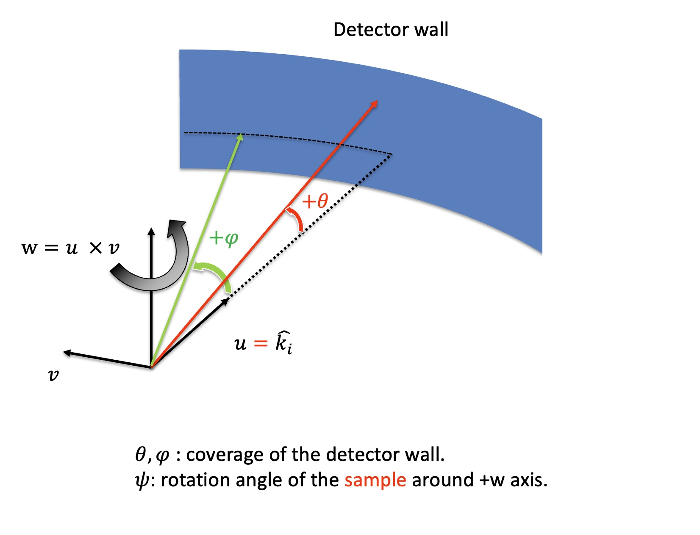
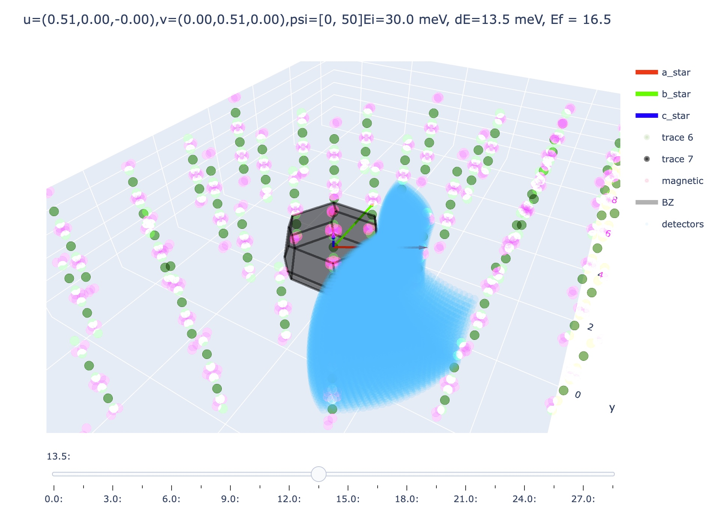
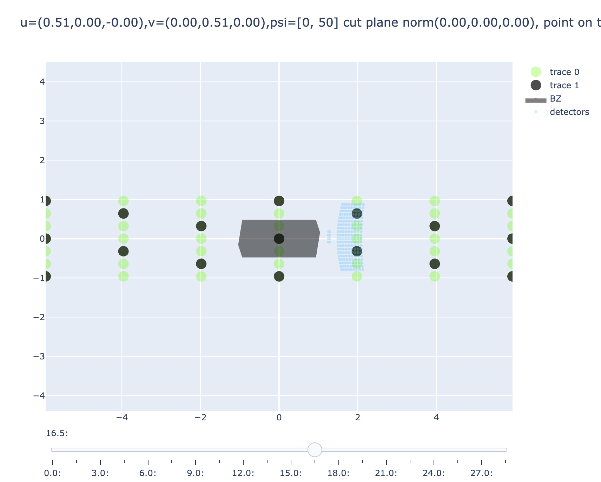
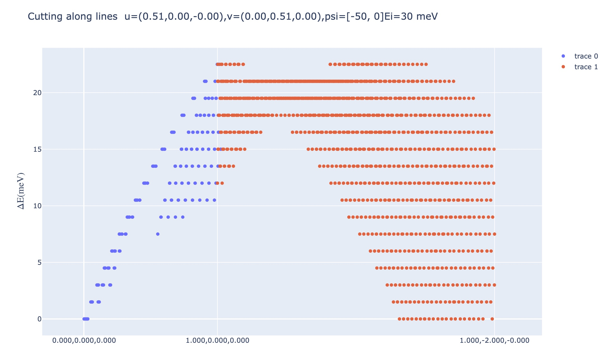

# NeutronScatteringCoverageSimulation

中子散射TOF谱仪的模拟程序。目前还在开发中。

A simulation program for neutron TOF spectrometers, which is currently under development.

<div align=center></div>

## 快速开始 Quick start 

### 安装 Installation 

下载解压后，将终端路径调整到解压后到文件夹内，输入
```
pip install .
```
即可安装完成。

After downloading and extracting the package, navigate to the extracted folder in your terminal, and install through pip.

### 使用 Usage

安装完成后即可使用。具体可参考下方的例子。

Once installation is complete, the program can be used directly. Please refer to the example below for details.


#### 例子 Example

##### 三维K空间 3D K space

```python
from crystal_toolkit import *

#从cif文件创建晶格 create Lattice from .cif file
lattice = Lattice.from_cif(
    "cif path",
    reciprocal_lattice_N_list = [3, 3, 5], # -3<=H<=3 , -3<=K<=3,-5<=L<=5
)

lattice.set_magnetic_points([[0.5,0,0]]) #设置磁峰，出现位置为G+q, G-q
# Set the magnetic Bragg peaks

u = lattice.get_hkl_vector(0, 0, 1) # u的方向就是入射中子的方向
# The u direction corresponds to the incident neutron beam direction.
v = lattice.get_hkl_vector(1, 0, 0) # v与u一起决定散射平面
# The v direction, together with u, defines the scattering plane.
w = lattice.get_hkl_vector(-1, 2, 0) # w为旋转轴，默认为cross(u,v)
# The w axis is the rotation axis, and by default it is defined as cross(u, v).

incident_energy = 20 #单位为meV unit is meV
psi = [0,180] #psi最大值与最小值, psi为晶体绕w轴旋转的角度 Maximum and minimum values of psi, where psi is the angle of rotation of crystals about the w-axis.

#phi与theta的范围，两个列表一一对应，将探测器范围cover全
# The ranges of phi and theta are specified as two lists, with each pair corresponding to one setting. Together, they are used to fully cover the detector range.
phi = [[-20,30],[30,50]] 
theta = [[-10,10],[-7,7]]

slice_number = 10 #从0到Ei共画多少张图 How many plots are generated when stepping from 0 to Ei
angle_step = 2 #张成探测器coverage时的角度步长 Angular step size for detector coverage

detector_config = DetectorConfig(
    incident_energy=incident_energy,
    detector_u=u,
    detector_v=v,
  	detector_w=w,
    theta_ranges=theta
    phi_ranges=phi
    psi_range= psi,
)


detector = Detector(detector_config, slice_number=slice_number, angle_step=angle_step)

KSpace3D(lattice, detector).plot(
    is_plot_detectors=True, is_plot_magnetic_peaks=True
).show()


```

示例 Example
<div align=center></div>


##### 二维K空间 2D K space


```python
from crystal_toolkit import *

#从cif文件创建Lattice
lattice = Lattice.from_cif(
    "cif path",
    reciprocal_lattice_N_list = [3, 3, 5], # -3<=H<=3 , -3<=K<=3,-5<=L<=5
)

lattice.set_magnetic_points([[0.5,0,0]]) #设置磁峰，出现位置为G+q, G-q

u = lattice.get_hkl_vector(0, 0, 1) # u的方向就是入射中子的方向
v = lattice.get_hkl_vector(1, 0, 0) # v与u一起决定散射平面
w = lattice.get_hkl_vector(-1, 2, 0) # w为旋转轴，默认为cross(u,v)

incident_energy = 20 #单位为meV
psi = [0,180] #psi最大值与最小值
#phi与theta的范围，两个列表一一对应，将探测器范围cover全
phi = [[-20,30],[30,50]] 
theta = [[-10,10],[-7,7]]

slice_number = 10 #dE从0到Ei共画多少张图
angle_step = 2 #张成探测器coverage时的角度步长

norm = lattice.get_hkl_vector(1, -2, 0) # 平面的法向量 The normal vector to the plane
plane_point = lattice.get_hkl_vector(0, 0, 0) # 平面上的一个点 A point on the plane
new_ex = lattice.get_hkl_vector(1, 0, 0) # 决定2维图的x方向，该方向为new_ex在平面上的投影 Define the x-direction of the 2D plot as the projection of new_ex onto the plane.
thick = lattice.lattice_data.a_star_par / 20 # 平面切片的厚度，这里设置为a*的1/20 Thickness of the planar slice, set here to 1/20 of a.

detector_config = DetectorConfig(
    incident_energy=incident_energy,
    detector_u=u,
    detector_v=v,
  	detector_w=w,
    theta_ranges=theta
    phi_ranges=phi
    psi_range= psi,
)


detector = Detector(detector_config, slice_number=slice_number, angle_step=angle_step)


KSpace2D(lattice, norm, plane_point, thick, new_ex, detector).plot(
    is_plot_detectors=True, is_plot_magnetic_peaks=True
).show()


```


示例 Example
<div align=center></div>


##### 一维Q-E覆盖图 1D Q-E coverage


```python
from crystal_toolkit import *

#从cif文件创建Lattice
lattice = Lattice.from_cif(
    "cif path",
    reciprocal_lattice_N_list = [3, 3, 5], # -3<=H<=3 , -3<=K<=3,-5<=L<=5
)

lattice.set_magnetic_points([[0.5,0,0]]) #设置磁峰，出现位置为G+q, G-q

u = lattice.get_hkl_vector(0, 0, 1) # u的方向就是入射中子的方向
v = lattice.get_hkl_vector(1, 0, 0) # v与u一起决定散射平面
w = lattice.get_hkl_vector(-1, 2, 0) # w为旋转轴，默认为cross(u,v)

incident_energy = 20 #单位为meV
psi = [0,180] #psi最大值与最小值
#phi与theta的范围，两个列表一一对应，将探测器范围cover全
phi = [[-20,30],[30,50]] 
theta = [[-10,10],[-7,7]]

slice_number = 10 #dE从0到Ei共画多少张图
angle_step = 2 #张成探测器coverage时的角度步长

# 定义需要cover的q点 
# Define the q-points requiring coverage.
q_points = [
    lattice.get_hkl_vector(0, 0, 0),
    lattice.get_hkl_vector(-1, 0, 2),
    lattice.get_hkl_vector(-1, 0, -1),
]

width = lattice.lattice_data.a_star_par / 20 #设置投影的线的宽度


detector_config = DetectorConfig(
    incident_energy=incident_energy,
    detector_u=u,
    detector_v=v,
  	detector_w=w,
    theta_ranges=theta
    phi_ranges=phi
    psi_range= psi,
)


detector = Detector(detector_config, slice_number=slice_number, angle_step=angle_step)

Detector1DPlotter(
    detector,
    q_points,
    width,
    lattice.lattice_data.conv_reciprocal_matrix,
).plot().show()

```


示例 Example
<div align=center></div>


##### 白光align模拟(测试中) White beam alginment (testing)
这个函数稍微复杂一些，是用dash写的，所以需要打开浏览器输入对应的本地服务器地址。关闭时也需要手动关闭dash服务器。

```python
from crystal_toolkit import *

#从cif文件创建Lattice
lattice = Lattice.from_cif(
    "cif path",
    reciprocal_lattice_N_list = [3, 3, 5], # -3<=H<=3 , -3<=K<=3,-5<=L<=5
)

u = lattice.get_hkl_vector(0, 0, 1) # u的方向就是入射中子的方向
v = lattice.get_hkl_vector(1, 0, 0) # v与u一起决定散射平面
w = lattice.get_hkl_vector(-1, 2, 0) # w为旋转轴，默认为cross(u,v)

incident_energy = 20 #单位为meV
psi = [-30,30] #psi最大值与最小值，可以设置在0附近的角度，因为在align之前已经有预估入射中子的方向了
#phi与theta的范围，两个列表一一对应，将探测器范围cover全
phi = [[-20,30],[30,50]] 
theta = [[-10,10],[-7,7]]

slice_number = 10 #dE从0到Ei共画多少张图
angle_step = 2 #张成探测器coverage时的角度步长


detector_config = DetectorConfig(
    incident_energy=incident_energy,
    detector_u=u,
    detector_v=v,
  	detector_w=w,
    theta_ranges=theta
    phi_ranges=phi
    psi_range= psi,
)


detector = Detector(detector_config, slice_number=slice_number, angle_step=angle_step)

Alignment2DPlotter(detector, lattice).plot().run()
```
