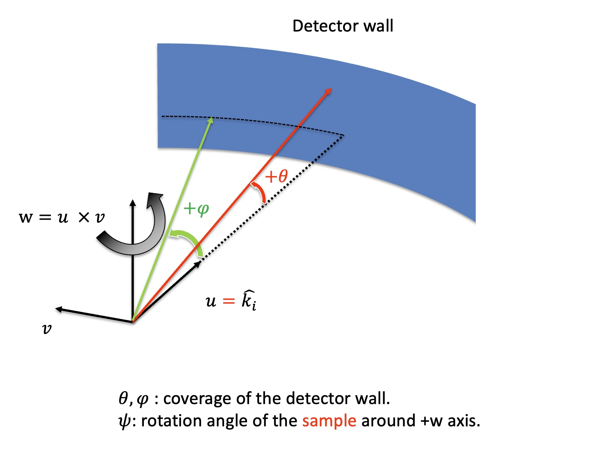
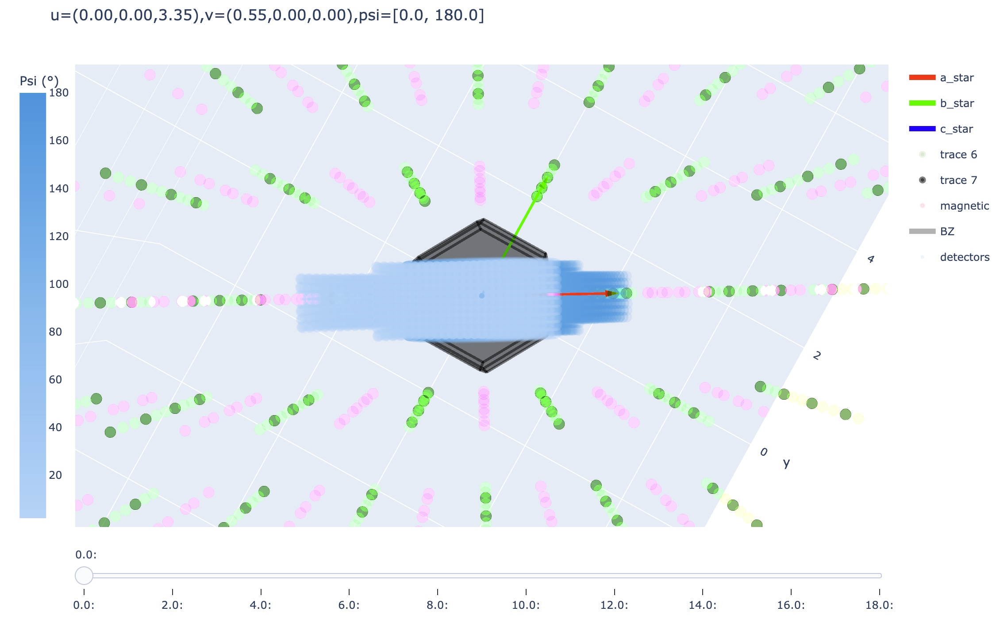
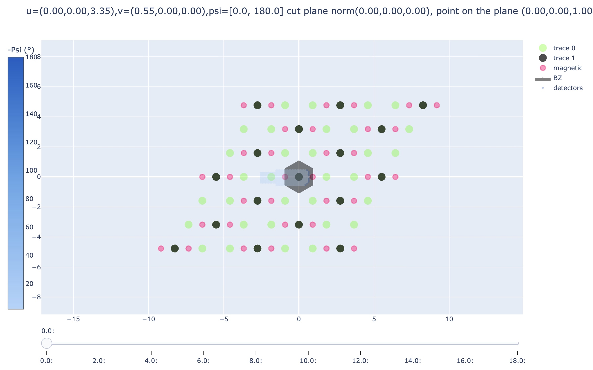
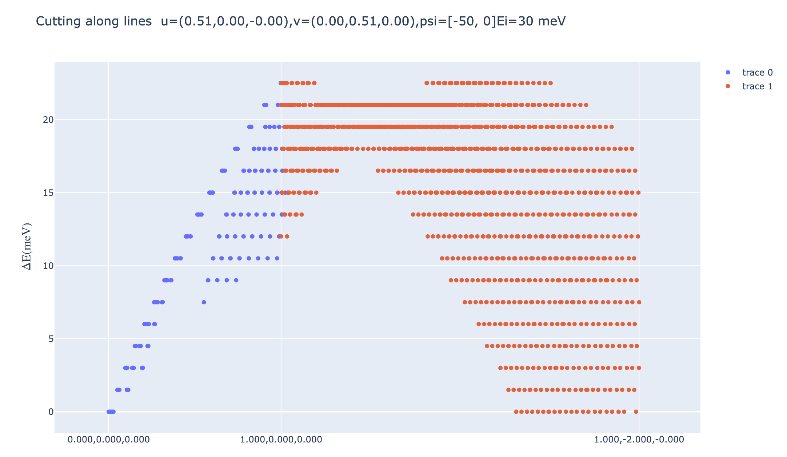

# NeutronScatteringCoverageSimulation

[](https://doi.org/10.5281/zenodo.16899301)

中子散射TOF谱仪的模拟程序。

A simulation program for neutron TOF spectrometers.

<div align=center></div>

---

## 🖥️ 图形界面 GUI

```bash
python -m crystal_toolkit.gui
```

浏览器将自动打开交互式界面，所有参数的配置和绘图均在界面中完成。

---

## 📦 安装

**依赖：** Python ≥ 3.10，建议使用 conda 环境。

```bash
# 从项目根目录安装
pip install -e .
```

安装完成后即可启动 GUI 或在代码中调用绘图功能。

---

## 🎮 使用

## 图形界面

```bash
python -m crystal_toolkit.gui
```

在浏览器界面中填写 CIF 路径、探测器参数、晶体参数，选择绘图类型（3D / 2D / 1D），点击 Generate Plot 生成图像。支持保存/加载配置、导出 HTML 图像。

## Python 代码调用

以下例子与 GUI 中的参数一一对应。

### 三维 K 空间 3D K-space

```python
from crystal_toolkit import *

lattice = Lattice.from_cif("cif path", reciprocal_lattice_N_list=[3, 3, 5])
lattice.set_magnetic_points([[0.5, 0, 0]])
u = lattice.get_hkl_vector(0, 0, 1)
v = lattice.get_hkl_vector(1, 0, 0)
w = lattice.get_hkl_vector(-1, 2, 0)

detector_config = DetectorConfig(
    incident_energy=20,
    detector_u=u, detector_v=v, detector_w=w,
    theta_ranges_direct=[[-10, 10], [-7, 7]],
    phi_ranges=[[-20, 30], [30, 50]],
    psi_range=[0, 180],
)
detector = Detector(detector_config, slice_number=10, angle_step=2)

KSpace3D(lattice, detector).plot(
    is_plot_detectors=True, is_plot_magnetic_peaks=True
).show()
```

<div align=center></div>

### 二维 K 空间 2D K-space

```python
from crystal_toolkit import *

lattice = Lattice.from_cif("cif path", [3, 3, 5])
lattice.set_magnetic_points([[0.5, 0, 0]])
u = lattice.get_hkl_vector(0, 0, 1)
v = lattice.get_hkl_vector(1, 0, 0)
w = lattice.get_hkl_vector(-1, 2, 0)

detector_config = DetectorConfig(
    incident_energy=20,
    detector_u=u, detector_v=v, detector_w=w,
    theta_ranges_direct=[[-10, 10], [-7, 7]],
    phi_ranges=[[-20, 30], [30, 50]],
    psi_range=[0, 180],
)
detector = Detector(detector_config, slice_number=10, angle_step=2)

norm = lattice.get_hkl_vector(1, -2, 0)
plane_point = lattice.get_hkl_vector(0, 0, 0)
new_ex = lattice.get_hkl_vector(1, 0, 0)
thick = lattice.lattice_data.a_star_par / 20

KSpace2D(lattice, norm, plane_point, thick, new_ex, detector).plot(
    is_plot_detectors=True, is_plot_magnetic_peaks=True
).show()
```

<div align=center></div>

### 一维 Q-E 覆盖图 1D Q-E coverage

```python
from crystal_toolkit import *

lattice = Lattice.from_cif("cif path", [3, 3, 5])
lattice.set_magnetic_points([[0.5, 0, 0]])
u = lattice.get_hkl_vector(0, 0, 1)
v = lattice.get_hkl_vector(1, 0, 0)
w = lattice.get_hkl_vector(-1, 2, 0)

detector_config = DetectorConfig(
    incident_energy=20,
    detector_u=u, detector_v=v, detector_w=w,
    theta_ranges_direct=[[-10, 10], [-7, 7]],
    phi_ranges=[[-20, 30], [30, 50]],
    psi_range=[0, 180],
)
detector = Detector(detector_config, slice_number=10, angle_step=2)

q_points = [
    lattice.get_hkl_vector(0, 0, 0),
    lattice.get_hkl_vector(-1, 0, 2),
    lattice.get_hkl_vector(-1, 0, -1),
]
width = lattice.lattice_data.a_star_par / 20

Detector1DPlotter(
    detector, q_points, width,
    lattice.lattice_data.conv_reciprocal_matrix,
).plot().show()
```

<div align=center></div>

---

## 🔧 开发

```bash
# 可编辑模式安装
pip install -e .

# 运行 GUI
python -m crystal_toolkit.gui
```
